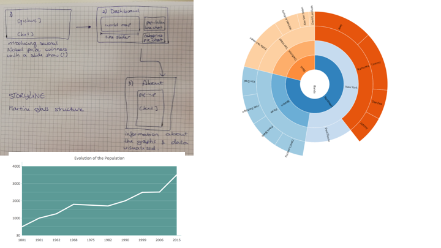

* a list of APIs or D3 plugins that you will be using to provide functionality in your app

# Design

## Data sources

All datasources below were attained in .json format or converted from .csv
to .json files. All .json files have been tested on validity.

* [World map](http://bl.ocks.org/micahstubbs/raw/8e15870eb432a21f0bc4d3d527b2d14f/a45e8709648cafbbf01c78c76dfa53e31087e713/world_countries.json)
* [Nobel prizes (zip file)](https://data.world/sya/nobel-prize-winners/workspace/file?filename=nobel_prize_by_winner.csv )
  * Nobel prizes per winner
  * Nobel prizes over time
* [Population per country](https://data.worldbank.org/indicator/SP.POP.TOTL)
* [Female population per country (%)](https://data.worldbank.org/indicator/SP.POP.TOTL.FE.ZS)
* Primary education enrolment (gross)
  * [Total](https://data.worldbank.org/indicator/SE.PRM.ENRR)
  * [Female](https://data.worldbank.org/indicator/SE.PRM.ENRR.FE)
  * [Male](https://data.worldbank.org/indicator/SE.PRM.ENRR.MA)
* Secondary education enrolment (gross)
  * [Total](https://data.worldbank.org/indicator/SE.SEC.ENRR)
  * [Female](https://data.worldbank.org/indicator/SE.SEC.ENRR.FE)
  * [Male](https://data.worldbank.org/indicator/SE.SEC.ENRR.MA)
* Tertiary education enrolment (gross)
  * [Total](https://data.worldbank.org/indicator/SE.TER.ENRR)
  * [Female](https://data.worldbank.org/indicator/SE.TER.ENRR.FE)
  * [Male](https://data.worldbank.org/indicator/SE.TER.ENRR.MA)
  * [GPI](https://data.worldbank.org/indicator/SE.ENR.TERT.FM.ZS)
* Doctoral or equivalent attainment (cumulative)
  * [Total](https://data.worldbank.org/indicator/SE.TER.CUAT.DO.ZS)
  * [Female](https://data.worldbank.org/indicator/SE.TER.CUAT.DO.FE.ZS)
  * [Male](https://data.worldbank.org/indicator/SE.TER.CUAT.DO.MA.ZS)

## Technical components

The project will have three 'pages'. It will start with an introduction to some
Nobel Prize winners followed by a question (for example: How are Nobel Prize
winners divided over the world?). Then the user will be directed to the
'dashboard'. This will be the main page with all the graphs. The third page will
be an 'about' page, with information about the datasets, the different graphs
and the purpose of the data visualisations.

* World map graph
  * Showing all countries
  * Showing the amount of Nobel Prize Winners by using shading
  * Possibility of selecting a certain year (or range of years)
  * Possibility of clicking on a country
  * Possibility of hovering over a country, visualizing the amount of Nobel
  prize winners

Needed:
* world.json file with the coordinates of the countries
* dataset with the Nobel Prize Winners
* function to calculate the amount of Nobel Prize Winners with the following filters: year, country, category.

* Pie chart
  * When a country is clicked a pie chart reveals the different categories of
  the Nobel prizes
  * Hovering shows amount per category
  * Clicking on a category updates the world map graph to just showing that category

Needed:
* dataset with the Nobel Prize Winners
* function to calculate the amount of Nobel Prize Winners with the following filters: year, country, category.

* Line graph
  * Showing primary, secondary and tertiary school enrolment

Needed:
* datasets with the data for the primary, secondary and tertiary school enrolment

## API's / D3 plugins

* D3-tip
* topojson 
